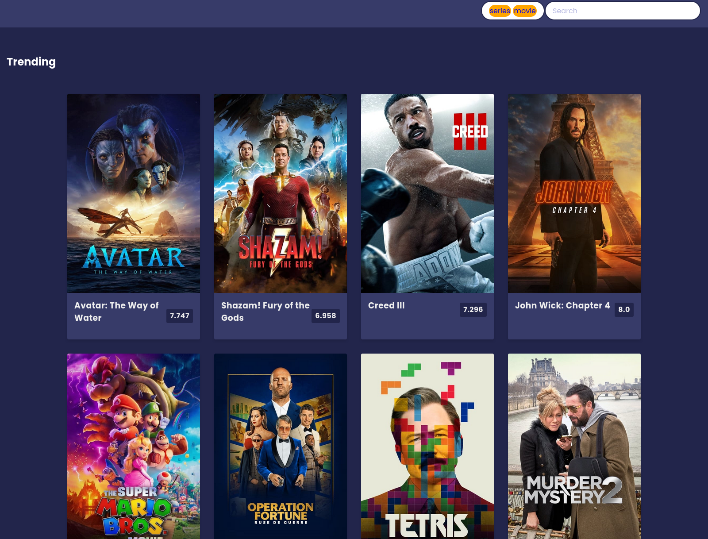

# A django app to search and play movies online

 

## Notes:
    * I do not support piracy & this project was created only out of curiosity.

    * I neither host nor have any rights to movies that may be listed in the web-page.

    * Recommended to use in private_tab (icognito_tab) of browser.

## Links

* ### [**demo in heroku**](https://movies-here.herokuapp.com)

* ### [**html/css template source**]()

## Working:

    * Movies are listed and searched using (TMDB API)[https://developers.themoviedb.org/3/getting-started/introduction].

    * videos are played using urls I got from online.

## Running code
    
        * Clone the repo: `git clone https://github.com/Aananda-giri/movies_and_videos.git`
    
        * Create a virtual environment and activate it
            * `virtualenv venv`
            * `source venv/bin/activate`
    
        * Install requirements
            * `pip install -r requirements.txt`
    
        * get the api key from (TMDB)[https://developers.themoviedb.org/3/getting-started/introduction]
            * insert the api key in `movies/views.py` as `API_KEY = << TMDB_API_KEY >>`

        * Django secret key
            * generate a secret key using
            * `python -c 'from django.core.management.utils import get_random_secret_key; print(get_random_secret_key())'`

            * insert the key generated to  `videos_project/settings.py`
                `SECRET_KEY = << SECRET_KEY_GENERATED >>`
        * Open the browser and go to http://